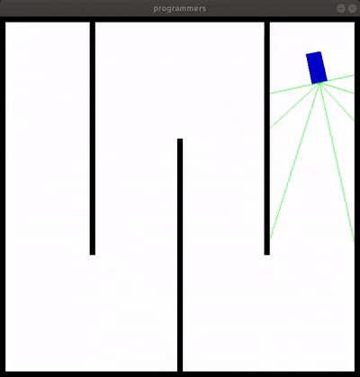

## 과제 : 센서를 이용한 장애물 회피 시뮬레이션을 DDPG로 학습시켜보기

### 1. DQN의 한계점
- discrete action space만 다룰 수 있다.  
  자이카의 조향값은 -50~50이 사이의 값을 가지는데 이름 101개의 action으로 보기보다 하나의 continuous한 action space으로 보는 것이 더 적합하지 않을까?
  DDPG는 continous한 action space를 다룰 수 있다.  
  
### 2. DQN과의 차이
- Network가 2개가 있다(Actor와 Critic)
  - DQN에서 action을 argmax Q(s)로 Q network를 통해 간접적으로 구했다면 DDPG에서는 action을 구하는 Actor Network가 있다.
  - Critic Network은 DQN과 마찬가지로 state와 action을 보고 그 가치를 예측하고 이를 통해 Actor를 평가한다.
- DQN에서는 랜덤하게 다른 action을 선택한 반면에 DDPG에서는 구한 action에 노이즈를 추가하는 방식으로 탐색범위를 넓힌다.
- 일정 step마다 target을 복제한것과 달리 DDPG에서는 soft target update를 한다.
  - 매 스텝 일정 비율만 복제하는 방식
- Experience Replay 기법을 사용하는 것은 동일하다.

### 3. Env
- env/env.py 의 Programmers_v2 클래스
- 제공하는 Environment는 gym API를 따른다.
  - env.reset(), env.step(action), env.render(), env.close()
- 약 1pixel = 1cm의 비율로 제작되었다.
- map은 올려준 도식도와 최대한 비슷하게 설정되어 있다.
- 센서 개수, 속도, observation features, reward 등 초기 설정값들은 docstring을 참조.
  
### 4. 목표
- Actor와 Critic network 작성
- hyper parameter 튜닝
- 기타 Reward / observation features / noise 방식 혹은 다른 기법들을 사용하여 성능 향상시키기

### 5. 제출 형식
- 코드의 압축파일
- 가장 결과가 좋은 weight파일(제출한 파일과 호환이 되는)
- 실행 영상

### 6. 예시
 

### 7. 참고한 곳
- https://spinningup.openai.com/en/latest/algorithms/ddpg.html